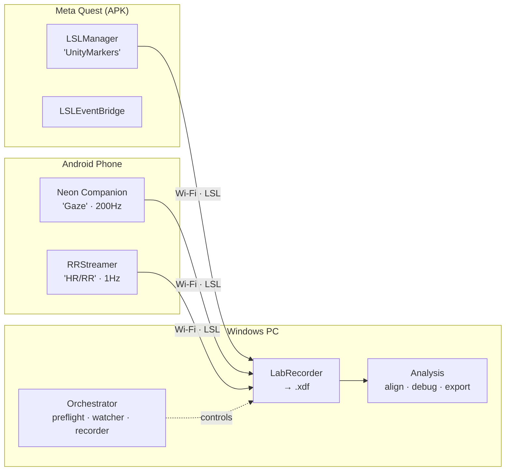
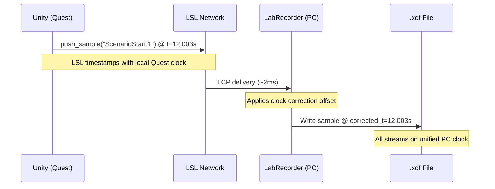
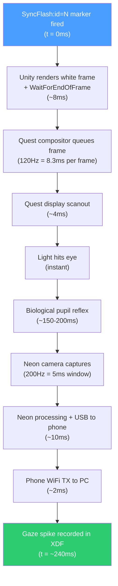

# TUM Sensor Sync

Multi-sensor synchronization framework for VR research. Captures gaze, pupil dilation, heart rate, and Unity scene events on a unified timebase with sub-millisecond alignment.

## What This Is

A toolkit for recording physiological data alongside VR experiences:

- **Unity package** (`com.tum.sensorsync`) — fires timestamped string markers from any scene over LSL
- **Orchestrator** (`orchestrator/`) — monitors all sensor streams, records to XDF, handles dropouts
- **Analysis** (`analysis/`) — validates alignment, measures latency, exports aligned CSV

## Architecture



All devices on the same Wi-Fi network. LSL handles clock synchronization across devices automatically.



## How Time Alignment Works

### The Problem

Each device has its own clock. The Quest might be off by hours relative to the PC. The phone might be off by days. Raw timestamps from different devices are not comparable.

### LSL Clock Correction

LSL solves this transparently:

1. When a stream connects, LSL pings the remote device every few seconds
2. It measures round-trip time and computes the clock offset
3. When you load the XDF file, `pyxdf` applies these corrections automatically
4. Result: all timestamps on a unified clock with ~1ms residual jitter

You never need to do this manually. After loading with `pyxdf.load_xdf()`, all timestamps across all streams are already aligned.

### SyncFlash — Measuring Physical Pipeline Latency

Clock alignment tells you WHEN each event was recorded. But there's a separate question: how long does it take for a visual stimulus to physically reach the eye tracker?

The SyncFlash sequence measures this end-to-end pipeline:



| Stage | Duration | Cumulative | Measurable? |
|-------|----------|-----------|-------------|
| Unity render to EndOfFrame | ~8ms | 8ms | Yes (`unityMs` in marker) |
| Quest compositor (120Hz) | ~8ms | 16ms | No (OS-level) |
| Display scanout | ~4ms | 20ms | No (hardware) |
| Biological pupil reflex | ~150-200ms | 200ms | No (physiology) |
| Neon acquisition (200Hz) | ~5ms | 225ms | No (camera timing) |
| Neon processing + USB | ~10ms | 235ms | No (device internal) |
| WiFi to PC | ~2ms | 237ms | No (network) |
| **Total measured** | **~240ms** | | **Yes (spike_t - flash_t)** |

The total is dominated by the biological pupil light reflex. Only `unityMs` and the total are directly measurable from the data. The breakdown above is estimated from hardware specs.

**Key point:** This latency does NOT affect timestamp alignment. Both the SyncFlash marker and the gaze spike have correct timestamps (thanks to LSL clock sync). The latency tells you the physical delay between stimulus and measurement — subtract it when computing reaction times.

**What each marker means:**

| Marker | When it fires | What it measures |
|--------|--------------|------------------|
| `SyncFlashRequest:id=N` | Before any visual change | Code entry point |
| `SyncFlashStateSet:id=N` | After overlay activated | State change confirmed |
| `SyncFlash:id=N` | Main reference timestamp | **Use this for latency calc** |
| `SyncFlashEndOfFrame:id=N:unityMs=X` | After WaitForEndOfFrame | Unity render cost |
| `SyncFlashFrameTiming:id=N:cpuMs=X:gpuMs=Y` | ~6 frames later | Approximate frame times |

**How total latency is computed:**

```
total_latency_ms = (gaze_spike_timestamp - SyncFlash_marker_timestamp) * 1000
```

Where `gaze_spike_timestamp` is found by detecting the luminance spike in the Neon "worn" channel after the flash.

**What the latency includes:**
1. Unity end-of-frame to GPU submit (~8ms)
2. Quest OS compositor queuing (~11ms at 90Hz)
3. Quest display scanout (~5ms)
4. Light travels to eye (instant)
5. Biological pupil response (~0ms for luminance, ~200ms for pupillary reflex)
6. Neon camera acquisition (~5ms at 200Hz)
7. Neon processing + USB transfer to phone (~10ms)
8. Phone WiFi TX to PC (~2ms)

**Is this latency a problem for alignment?**

No. The timestamps are already correct thanks to LSL clock sync. The SyncFlash latency tells you the precision limit: if you see a gaze change 250ms after a stimulus, ~250ms of that is pipeline delay, not reaction time. Subtract the measured pipeline latency to get true response time.

### How a Marker Gets Registered

When you call `LSLManager.Instance.SendMarker("MyEvent")`:

1. The string is pushed to the LSL outlet (`StreamOutlet.push_sample`)
2. LSL timestamps the sample with the local clock (nanosecond precision)
3. The sample is queued for TCP delivery to any connected inlets
4. LabRecorder on PC pulls the sample and writes it to the XDF with the original timestamp
5. When you load the XDF, pyxdf applies the clock correction offset

The marker timestamp reflects the exact moment `push_sample` was called on the Quest, corrected to the PC clock. This is NOT when the PC received it — it's when the Quest sent it.

Typical end-to-end from `SendMarker()` call to appearing in the recording: <5ms (WiFi network delivery). But the timestamp recorded is the send time, not arrival time, so this delivery delay doesn't affect alignment.

## Installation

### For Unity projects (the package)

Add both packages to your project's `Packages/` folder:

```
YourProject/
  Packages/
    com.tum.sensorsync/          ← copy from this repo
    com.labstreaminglayer.lsl4unity/  ← copy from this repo
    manifest.json                ← add entries below
```

In `manifest.json`:
```json
{
  "dependencies": {
    "com.labstreaminglayer.lsl4unity": "file:com.labstreaminglayer.lsl4unity",
    "com.tum.sensorsync": "file:com.tum.sensorsync"
  }
}
```

Or via git URL:
```json
"com.tum.sensorsync": "https://github.com/MSherbinii/TUMSensorSync.git?path=Packages/com.tum.sensorsync"
```

Then: **Tools > TUM Sensor Sync > Add to Scene**

### For the research PC (orchestrator + analysis)

```bash
pip install pylsl rich pyxdf pandas numpy scipy matplotlib
```

Download LabRecorder from https://github.com/labstreaminglayer/App-LabRecorder/releases
Copy `LabRecorderCLI.exe` + `lsl.dll` into `orchestrator/bin/`

Copy `orchestrator/config.json.template` to `orchestrator/config.json` and edit your device serials.

## Usage

### Sending markers from Unity

```csharp
// From any script — no imports needed
LSLManager.Instance.SendMarker("ScenarioStart:1");
LSLManager.Instance.SendMarker("UserAction:button_pressed");
LSLManager.Instance.FireSyncFlash();

// Via the bridge (Inspector-configurable)
FindObjectOfType<LSLEventBridge>().FireMarker("MyEvent");
```

### Running a session

```bash
# 1. Verify all streams are visible
python orchestrator/preflight.py

# 2. Start recording (auto-starts when all streams connect)
python orchestrator/run_session.py

# 3. After session — validate and export
python analysis/validate_and_align.py Data/Recordings/P001.xdf
python analysis/debug_timing.py Data/Recordings/P001.xdf
```

### Output CSV format

One row per gaze sample (200Hz). Columns:

| Column | Description |
|--------|-------------|
| `timestamp` | LSL unified clock (all devices corrected) |
| `time_s` | Seconds from session start (0-based) |
| `gaze_x`, `gaze_y` | Screen-space gaze position |
| `pupil_left_mm`, `pupil_right_mm` | Pupil diameter |
| `hr_bpm` | Heart rate interpolated to 200Hz |
| `rr_ms` | R-R interval interpolated to 200Hz |
| `phase` | Current experiment phase |
| `speaker` | Who is currently speaking |

## Configuration

`orchestrator/config.json` controls all sensor settings:

```json
{
  "marker_stream_name": "UnityMarkers",
  "devices": [
    {
      "label": "Neon Gaze",
      "match": "type",
      "value": "Gaze",
      "required": true,
      "nominal_hz": 200,
      "channels": {"gaze_x": 0, "gaze_y": 1, "pupil_left_mm": 7, "pupil_right_mm": 8}
    },
    {
      "label": "HR Polar H10 XXXXXXXX",
      "match": "name",
      "value": "HR Polar H10 XXXXXXXX",
      "required": true,
      "nominal_hz": 1
    }
  ],
  "recording": {
    "labrecorder_cli": "bin/LabRecorderCLI.exe",
    "data_dir": "../../Data/Recordings"
  },
  "timing": {
    "dropout_timeout_s": 3.0,
    "auto_stop_delay_s": 10
  }
}
```

Add/remove devices freely. No code changes needed.

## For Vendors

If you're integrating this into a closed-source APK:

1. Copy `Packages/com.tum.sensorsync/` and `Packages/com.labstreaminglayer.lsl4unity/` into your Unity project
2. Add entries to `manifest.json` (see above)
3. Use **Tools > TUM Sensor Sync > Add to Scene** in your first/main scene
4. Call `LSLManager.Instance.SendMarker("EventName")` at key moments
5. Set the Inspector's "Marker Stream Name" to match what the research team tells you
6. Build as Android ARM64 (IL2CPP)

You don't need Python, config files, or any sensor hardware. The research team handles recording.

## Hardware

| Device | Role | Stream |
|--------|------|--------|
| Meta Quest 2/3 | VR headset | `"UnityMarkers"` (string, irregular) |
| Pupil Labs Neon | Eye tracker (clips into Quest face gasket) | `"Gaze"` (22ch, 200Hz) |
| Polar H10 | Chest strap HR monitor | `"HR Polar H10 XXX"` (1ch, ~1Hz) |
| Android phone | Hub for Neon + RRStreamer apps | relays all sensor streams over WiFi |
| Windows PC | Records everything | runs orchestrator + LabRecorder |

## License

MIT
